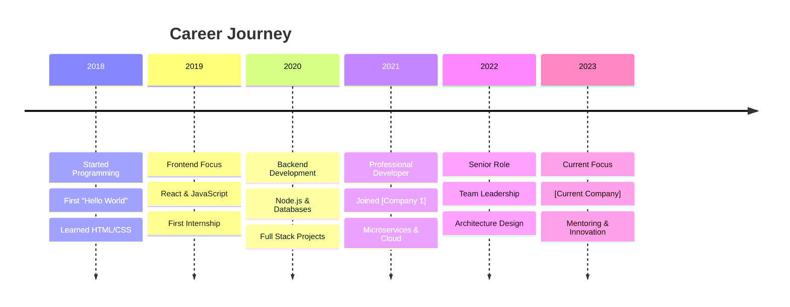

# Dynamic Typing Hero

A profile template featuring multiple dynamic typing animations and smooth transitions.

---

```markdown
<div align="center">
  
  <!-- Animated Header -->
  
  
  <!-- Main Typing Animation -->
  
  
</div>

---

## 🚀 About Me


###  About Me

```typescript
const developer = {
    name: "YOUR_NAME",
    role: "Full Stack Developer",
    location: "🌍 Your Location",
    experience: "X+ years",
    currentFocus: "Building amazing web applications",
    passions: ["Coding", "Learning", "Coffee ☕"],
    
    workingOn: {
        🔭: "Amazing new project",
        🌱: "Learning new technologies", 
        👯: "Looking to collaborate on innovative projects",
        🤔: "Looking for help with system design",
        💬: "Ask me about web development",
        📫: "How to reach me: your.email@example.com",
        😄: "Pronouns: He/Him",
        ⚡: "Fun fact: I debug with console.log 😅"
    }
};
```

---

## 🛠️ Tech Stack

<div align="center">

### Languages


### Frontend


### Backend & Database


### DevOps & Tools


</div>

---

## 📊 GitHub Analytics

<div align="center">
  
  <!-- Animated GitHub Stats -->
  
  
  
  <!-- Animated Streak Stats -->
  
  
  <!-- Dynamic GitHub Activity Graph -->
  
  
  <!-- Animated Trophies -->
  
  
</div>

---

## 🔥 Recent Activity

<div align="center">
  
  <!-- Dynamic WakaTime Stats -->
  
  
</div>

<!--START_SECTION:waka-->
<!--END_SECTION:waka-->

---

## 🎯 Current Projects

<div align="center">

  <!-- Animated Repo Cards -->
  <a href="https://github.com/YOUR_USERNAME/PROJECT1">
    
  </a>
  <a href="https://github.com/YOUR_USERNAME/PROJECT2">
    
  </a>
  
</div>

---

## 🐍 Contribution Snake

<div align="center">
  
  <!-- Animated Snake -->
  <picture>
    <source media="(prefers-color-scheme: dark)" srcset="https://raw.githubusercontent.com/YOUR_USERNAME/YOUR_USERNAME/output/github-contribution-grid-snake-dark.svg">
    <source media="(prefers-color-scheme: light)" srcset="https://raw.githubusercontent.com/YOUR_USERNAME/YOUR_USERNAME/output/github-contribution-grid-snake.svg">
    
  </picture>
  
</div>

---

## 💼 Experience Timeline

<div align="center">



</div>

---

## 🎨 Skills Visualization

<div align="center">

<!-- Animated Skill Bars -->


### Proficiency Levels

```
JavaScript/TypeScript  ████████████████████ 100%
React/Vue.js          ██████████████████░░  90%
Node.js/Express       ████████████████░░░░  85%
Python/Django         ███████████████░░░░░  80%
DevOps/Cloud          ██████████████░░░░░░  75%
System Design         █████████████░░░░░░░  70%
```

</div>

---

## 📱 Connect With Me

<div align="center">
  
  <!-- Animated Connect Section -->
  
  
  <br/><br/>
  
  [](https://linkedin.com/in/YOUR_PROFILE)
  [](https://twitter.com/YOUR_USERNAME)
  [](https://YOUR_WEBSITE.com)
  [](mailto:YOUR_EMAIL@example.com)
  [](https://discord.gg/YOUR_DISCORD)
  
</div>

---

## 📈 Profile Analytics

<div align="center">
  
  <!-- Animated Profile Views Counter -->
  
  
  <!-- Fun Quote -->
  <br/><br/>
  
  
</div>

---

<!-- Animated Footer -->

```

---

## Customization Guide

1. **Animations Setup**
   - All typing animations use [readme-typing-svg](https://github.com/DenverCoder1/readme-typing-svg)
   - Customize text, colors, and timing in URL parameters
   - Test different fonts and speeds for optimal effect

2. **Personal Information**
   - Replace `YOUR_NAME` in all animations and code blocks
   - Update the TypeScript object with your real information
   - Modify location, experience, and contact details

3. **Tech Stack Icons**
   - Use [skillicons.dev](https://skillicons.dev) for animated tech icons
   - Update with your actual technology stack
   - Maintain consistent theming across all icons

4. **GitHub Integration**
   - Replace `YOUR_USERNAME` in all GitHub URLs
   - Set up WakaTime integration for coding stats (optional)
   - Update repository names in project showcase

5. **Snake Animation**
   - Set up GitHub Actions workflow for snake generation
   - Follow [platane/snk](https://github.com/platane/snk) instructions
   - Customize colors and style preferences

6. **Timeline Customization**
   - Update the Mermaid timeline with your career journey
   - Add/remove years and milestones as needed
   - Keep descriptions concise but meaningful

---

## Animation Features

- 🌊 **Wave Headers/Footers** - Smooth animated borders
- ⌨️ **Multiple Typing Effects** - Dynamic text animations
- 📊 **Animated Stats** - GitHub statistics with smooth loading
- 🐍 **Snake Animation** - Contribution grid visualization
- 🏆 **Trophy Display** - Achievement showcase
- 📈 **Activity Graph** - Contribution heatmap
- 🎨 **Skill Icons** - Animated technology logos

---

## Setup Instructions

1. **GitHub Actions for Snake**
   ```yaml
   name: Generate snake animation
   
   on:
     schedule:
       - cron: "0 */12 * * *"
     workflow_dispatch:
   
   jobs:
     generate:
       runs-on: ubuntu-latest
       steps:
         - uses: Platane/snk@v3
           with:
             github_user_name: YOUR_USERNAME
             outputs: |
               dist/github-contribution-grid-snake.svg
               dist/github-contribution-grid-snake-dark.svg?palette=github-dark
   ```

2. **WakaTime Integration** (Optional)
   - Sign up for [WakaTime](https://wakatime.com)
   - Set up time tracking in your IDE
   - Add WakaTime username to stats URL

3. **Capsule Render Customization**
   - Visit [capsule-render](https://github.com/kyechan99/capsule-render)
   - Customize wave type, colors, and animations
   - Generate custom header/footer URLs

---

## Tips for This Template

- ✅ Test all animations in different browsers
- ✅ Keep loading times reasonable
- ✅ Update GitHub usernames consistently
- ✅ Use cohesive color themes
- ❌ Don't overuse animations (maintain readability)
- ❌ Avoid too many different animation styles
- ❌ Don't forget to set up required workflows

---

