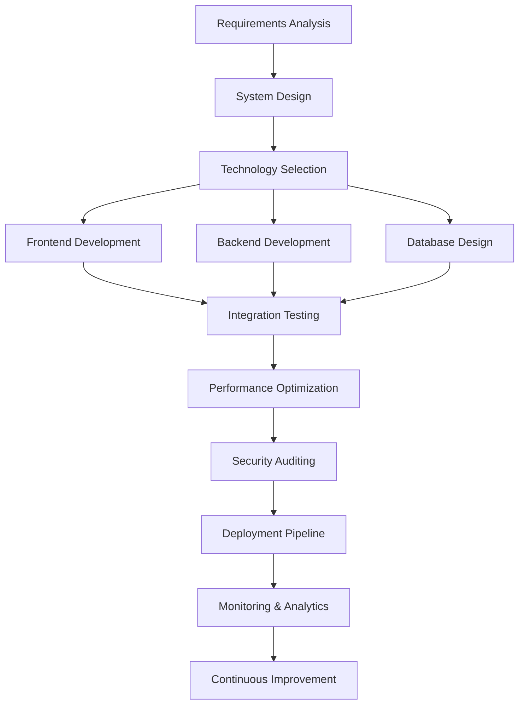

# Full Stack Engineer

Comprehensive development profile showcasing complete software engineering capabilities across all layers.

---

```markdown
<div align="center">

# 🚀 [Your Name] - Full Stack Engineer

**Building Complete Digital Solutions from Frontend to Database**

---

```
  ┌─ FRONTEND ─┐    ┌─ BACKEND ─┐    ┌─ DATABASE ─┐    ┌─ DEVOPS ─┐
  │    React   │◄──►│  Node.js  │◄──►│ PostgreSQL │◄──►│  Docker  │
  │   Vue.js   │    │  Express  │    │  MongoDB   │    │   AWS    │
  │ TypeScript │    │  Python   │    │   Redis    │    │   CI/CD  │
  └────────────┘    └───────────┘    └────────────┘    └──────────┘
```

**📍 Based in**: [Your Location] | **🏢 Currently at**: [Your Company]  
**💼 Experience**: X+ years | **🎯 Specialization**: End-to-end application development

</div>

---

## 🏗️ Full Stack Architecture


### 🎨 Frontend Layer
```typescript
interface FrontendSkills {
  frameworks: ["React", "Vue.js", "Angular", "Svelte"];
  languages: ["TypeScript", "JavaScript", "HTML5", "CSS3"];
  styling: ["Tailwind CSS", "Styled Components", "SASS"];
  tools: ["Webpack", "Vite", "Next.js", "Nuxt.js"];
  testing: ["Jest", "Cypress", "Testing Library"];
  
  getCurrentFocus(): string {
    return "Building responsive, accessible user interfaces";
  }
}
```

### ⚙️ Backend Layer
```python
class BackendExpertise:
    def __init__(self):
        self.languages = ["Python", "Node.js", "Java", "Go"]
        self.frameworks = ["Express", "Django", "FastAPI", "Spring"]
        self.apis = ["REST", "GraphQL", "gRPC", "WebSocket"]
        self.auth = ["JWT", "OAuth", "SAML", "Auth0"]
        self.testing = ["Jest", "PyTest", "Postman", "Insomnia"]
    
    def build_scalable_systems(self):
        return "Designing robust backend architectures"
```

### 🗄️ Database Layer
```sql
-- Database Technologies & Design Patterns
SELECT 
    'PostgreSQL' as relational_primary,
    'MongoDB' as document_store,
    'Redis' as caching_layer,
    'Elasticsearch' as search_engine
FROM developer_skills 
WHERE 
    experience_level = 'Expert' 
    AND design_patterns INCLUDES ('Microservices', 'Event-Driven')
    AND optimization_skills = 'Advanced';
```

### ☁️ DevOps & Infrastructure
```yaml
# DevOps & Deployment Pipeline
infrastructure:
  cloud_providers: ["AWS", "GCP", "Azure"]
  containerization: ["Docker", "Kubernetes"]
  ci_cd: ["GitHub Actions", "Jenkins", "GitLab CI"]
  monitoring: ["Prometheus", "Grafana", "ELK Stack"]
  infrastructure_as_code: ["Terraform", "CloudFormation"]

deployment_strategy:
  - zero_downtime_deployments
  - blue_green_deployment
  - canary_releases
  - automated_rollbacks
```

---

## 🛠️ Technology Stack Mastery

<div align="center">

### Frontend Technologies


### Backend Technologies


### Database & Storage


### DevOps & Cloud


</div>

---

## 📊 Engineering Metrics

<div align="center">


</div>

### 🎯 Skill Proficiency Matrix
```
┌─────────────────────────────────────────────────────────────┐
│                    FULL STACK EXPERTISE                    │
├─────────────────────────────────────────────────────────────┤
│ Frontend Development    ████████████████████ 95%          │
│ Backend Architecture    ████████████████████ 92%          │
│ Database Design         ██████████████████   88%          │
│ DevOps & Infrastructure ████████████████     85%          │
│ System Design           ██████████████████   90%          │
│ Testing & QA            ████████████████     83%          │
│ Project Management      ███████████████      78%          │
│ Team Leadership         ████████████████     80%          │
└─────────────────────────────────────────────────────────────┘

Performance Indicators:
├─ Code Review Efficiency: 24hr average turnaround
├─ Bug Resolution Rate: 95% within SLA
├─ Feature Delivery: On-time delivery 98% success rate
├─ System Uptime: 99.9% availability maintained
└─ Team Satisfaction: 4.8/5 collaboration rating
```

---

## 🏗️ Architecture Projects

### 🚀 [Enterprise E-commerce Platform](https://github.com/YOUR_USERNAME/enterprise-ecommerce)
```yaml
Project Type: Full Stack Application
Scale: Enterprise Level
Users: 100K+ active users
Team Size: 8 developers

Architecture:
  Frontend: React + TypeScript + Next.js
  Backend: Node.js + Express + GraphQL
  Database: PostgreSQL + Redis + Elasticsearch
  Infrastructure: AWS + Docker + Kubernetes
  
Key Features:
  - Microservices architecture
  - Real-time inventory management
  - Payment gateway integration
  - Advanced search and filtering
  - Admin dashboard with analytics
  
Performance Metrics:
  - Page Load Time: <2s average
  - API Response Time: <100ms
  - Database Query Optimization: 75% improvement
  - Server Response Time: 99.9% uptime
```

### ⚡ [Real-time Collaboration Platform](https://github.com/YOUR_USERNAME/realtime-collab)
```yaml
Project Type: Real-time Application
Scale: Mid-scale SaaS
Users: 10K+ concurrent users
Team Size: 5 developers

Technology Stack:
  Frontend: Vue.js + WebSocket + WebRTC
  Backend: Python + FastAPI + Socket.io
  Database: PostgreSQL + Redis Pub/Sub
  Infrastructure: AWS ECS + CloudFormation
  
Core Capabilities:
  - Real-time document collaboration
  - Video/audio communication
  - File sharing and version control
  - Role-based access control
  - Offline sync capabilities
  
Technical Achievements:
  - <50ms message latency
  - 99.95% connection stability
  - Horizontal scaling implementation
  - End-to-end encryption
```

### 🔧 [DevOps Automation Suite](https://github.com/YOUR_USERNAME/devops-automation)
```yaml
Project Type: DevOps Tooling
Scale: Internal Tooling
Impact: 50+ development teams
Team Size: 3 engineers

Infrastructure:
  Pipeline: GitHub Actions + Jenkins
  Monitoring: Prometheus + Grafana + ELK
  Infrastructure: Terraform + Ansible
  Security: SonarQube + Snyk + Vault
  
Automation Features:
  - Automated CI/CD pipelines
  - Infrastructure provisioning
  - Security scanning integration
  - Performance monitoring
  - Automated testing frameworks
  
Results:
  - 70% reduction in deployment time
  - 90% decrease in production incidents
  - 50% improvement in developer productivity
  - 99.9% system reliability
```

---

## 🎯 Full Stack Development Philosophy

### 🏛️ Architectural Principles
```javascript
const fullStackPrinciples = {
  scalability: {
    horizontal: "Design for distributed systems",
    vertical: "Optimize resource utilization",
    patterns: ["Microservices", "Event-driven", "CQRS"]
  },
  
  reliability: {
    testing: "Comprehensive test coverage",
    monitoring: "Proactive system monitoring", 
    recovery: "Graceful failure handling"
  },
  
  maintainability: {
    code: "Clean, documented, readable code",
    architecture: "Modular, loosely coupled design",
    documentation: "Comprehensive technical documentation"
  },
  
  security: {
    authentication: "Multi-factor authentication",
    authorization: "Role-based access control",
    encryption: "End-to-end data protection"
  }
};
```

### 🔄 Development Workflow


---

## 📚 Continuous Learning & Growth

### 🎓 Current Learning Focus
```python
class ContinuousLearning:
    def __init__(self):
        self.current_studies = [
            "Advanced Kubernetes Orchestration",
            "Serverless Architecture Patterns", 
            "Machine Learning Integration",
            "Blockchain Technology Applications"
        ]
        
        self.upcoming_certifications = [
            "AWS Solutions Architect Professional",
            "Google Cloud Professional Developer",
            "Certified Kubernetes Administrator"
        ]
    
    def weekly_learning_routine(self):
        return {
            "technical_reading": "10 hours/week",
            "hands_on_projects": "8 hours/week", 
            "community_contribution": "4 hours/week",
            "mentoring_others": "3 hours/week"
        }
```

### 📖 Knowledge Sharing
- **📝 Technical Blog**: [Your Blog URL] - 50+ articles on full-stack development
- **🎤 Conference Talks**: Speaker at [Conference Names]
- **👥 Mentorship**: Mentoring 5+ junior developers
- **🌟 Open Source**: Active contributor to 20+ repositories

---

## 🤝 Collaboration & Leadership

<div align="center">

### 🎯 Team Collaboration Stats
```
┌─────────────────────────────────────────────────────────────┐
│                   LEADERSHIP METRICS                       │
├─────────────────────────────────────────────────────────────┤
│ Team Projects Led:           15+ successful projects       │
│ Cross-functional Teams:      Frontend, Backend, DevOps     │
│ Code Review Contributions:   500+ reviews completed        │
│ Knowledge Transfer Sessions: 25+ technical presentations   │
│ Mentorship Impact:           10+ developers onboarded      │
└─────────────────────────────────────────────────────────────┘
```

**🎯 Engineering Excellence**:
- Established coding standards and best practices
- Implemented automated testing frameworks
- Led architecture decision-making processes
- Coordinated cross-team technical initiatives

</div>

---

## 🌐 Professional Network

<div align="center">

**🚀 Ready to build the next big thing together!**

[](mailto:your.email@example.com)
[](https://linkedin.com/in/YOUR_USERNAME)
[](https://twitter.com/YOUR_USERNAME)
[](https://YOUR_WEBSITE.com)
[](https://YOUR_BLOG.com)

**📧 Response Time**: Within 24 hours  
**🌍 Timezone**: [Your Timezone]  
**💬 Preferred Communication**: Email for formal, Slack for quick questions

</div>

---

<div align="center">

```
╔══════════════════════════════════════════════════════════════╗
║                     FULL STACK ENGINEER                     ║
║                                                              ║
║  "Any application that can be written in JavaScript,        ║
║   will eventually be written in JavaScript."                ║
║                                        - Atwood's Law       ║
║                                                              ║
║  "The best architecture is the one that delivers            ║
║   business value while remaining maintainable."             ║
║                                        - Full Stack Wisdom  ║
╚══════════════════════════════════════════════════════════════╝
```

### 🎯 Always building, always learning, always improving
**Let's create exceptional digital experiences together!**

</div>
```

---

## Customization Guide

### Full Stack Identity
1. **Professional Branding**: Emphasize your comprehensive technical capabilities
2. **Architecture Focus**: Highlight your system design and technical leadership
3. **Cross-functional Skills**: Showcase ability to work across all technology layers

### Personal Customization
1. **Experience Level**:
   - Update years of experience and current role
   - Adjust skill proficiency percentages accurately
   - Include your actual company and location

2. **Technology Stack**:
   - Replace with your actual technology preferences
   - Update proficiency levels based on real experience
   - Include specific frameworks and tools you use

3. **Project Showcases**:
   - Replace with your actual full-stack projects
   - Include real metrics and technical details
   - Update GitHub repository links

### Technical Depth
1. **Architecture Diagrams**: Consider adding actual architecture diagrams
2. **Code Examples**: Include snippets from your actual work
3. **Performance Metrics**: Use real data from your projects
4. **Team Impact**: Include actual leadership and collaboration examples

### Professional Development
1. **Learning Goals**: Update with your current focus areas
2. **Certifications**: Include your actual certifications and plans
3. **Speaking/Writing**: Add your real blog posts and conference talks
4. **Open Source**: Link to your actual contributions

---

## Full Stack Excellence Tips

### Technical Leadership
- Demonstrate both depth and breadth of knowledge
- Show ability to make architectural decisions
- Highlight cross-functional collaboration skills
- Include mentorship and knowledge sharing activities

### Project Presentation
- Focus on complete end-to-end solutions
- Emphasize scalability and performance considerations
- Include both technical and business impact
- Show evolution from simple to complex systems

### Continuous Growth
- Regular skill updates and learning goals
- Stay current with technology trends
- Contribute to developer community
- Balance specialization with generalization

This template positions you as a comprehensive full-stack engineer capable of handling complete software development lifecycle from conception to deployment and maintenance.